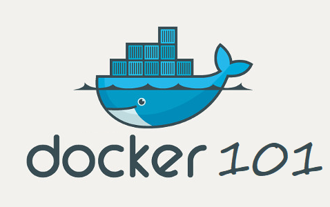

<center>
  <a href="https://docs.docker.com/"></a>
</center>

This repository contains a simple example of how to use Docker to create a website that uses a database and an API.
It was based on the [Docker em 22 minutos - teoria e prática](https://www.youtube.com/watch?v=Kzcz-EVKBEQ) video from [Ayrton Teshima - Programador a Bordo](https://www.youtube.com/@ProgramadorABordo) channel.

<h2>Table of contents</h2>

- [Useful Docker commands](#useful-docker-commands)
- [Important parameters](#important-parameters)
- [Windows vs Linux](#windows-vs-linux)
- [Project specific observations](#project-specific-observations)

### Useful Docker commands

Create images
```bash
  docker build -t <image_name> .
```

List images
```bash
  docker images
```

Create containers
```bash
  docker run -d -v <absolute_path_to_file>:<container_path> --link another-container-name -p <host_port>:<container_port> --name <container_name> <image_name>
```

List containers
```bash
  docker ps
```

Access containers
```bash
  docker exec -it <container_name> bash
```

Stop containers
```bash
  docker stop <container_name>
```

### Important parameters

- -d = detached mode (run in background, not blocking terminal)
- -f = file (dockerfile path)
- -t = tag (name of the image)
- -i = interactive mode (keep STDIN open even if not attached)
- -it = interactive mode + allocate a pseudo-TTY (terminal)
- -p = port (host_port:container_port)
- -v = volume (host_path:container_path)
- --link = link containers (container_name:alias)
- --name = name of the container
- --rm = remove container after stop

### Windows vs Linux

- Windows
  - %cd% = current path
  - \ = folder separator

- Linux
  - $(pwd) = current path
  - / = folder separator

### Project specific observations

- Go through the README.md files in the project folders in this order:
  - 1. api/db
  - 2. api
  - 3. website

- The order is important because the containers are linked and the database must be up and running before the api container starts
- The website container is not linked to any other container, so it can be started at any time
- The api container is linked to the database container, so it must be started after the database container
